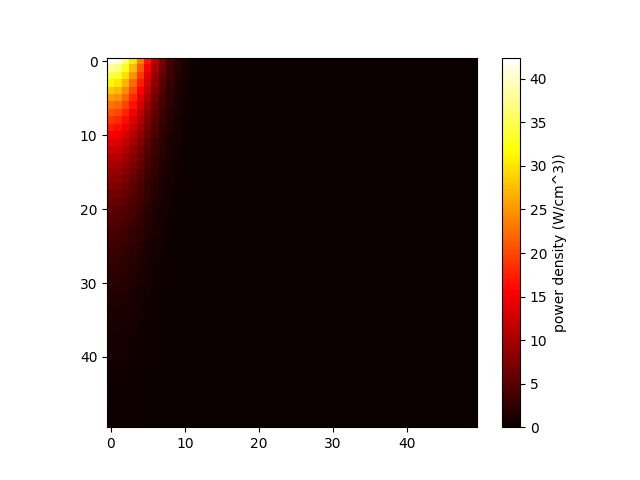

# FLIR thermal imaging, workup, simulation, and minimization for CB-PDMS-laser system

This repository contains scripts for the analysis of thermal images from a FLIR camera, simulation of heat transfer in a CB-PDMS/CW-laser system, and minimization of the simulation to experimental data.

## Workflow Overview

- Experimental
  - collect thermal images using FLIR camera at various lasing times
- Image Analysis
  - export thermal .jpg files
  - reconstruct thermal data with ImageJ plugin
  - extract thermal profile data along desired spatial orientations
- Simulation
  - simulate heat transfer in CB-PDMS/CW-laser system
  - export simulation data as array(s) with matching shape and spatial/temporal indices as experimental data
- Fitting
  - use lmfit to iteratively compare simulation results to experimental data with floating parameters and minimize residuals

## Using the FLIR image analyzer scripts for temperature profile analysis

The composite_analysis script found in the image_analysis directory takes the path to side- and top-view images exported from the ImageJ FLIR .txt temperature array plugin and outputs the combined profile as seen in the exports/CSVs/lmfit_consolidated directory

## Using lmfit for non-linear least-squares minimization (https://lmfit.github.io/lmfit-py/intro.html)

- write an "objective function" that takes the values of the fitting variables and calculates a value (or array of values), aka "residuals," to be minimized by the optimization algorithm
- create a Parameters object with the fitting variables along with their initial guesses and bonds

## Simulation Pseudo-code

    temperatureArray = Init_T_Grid(length, height, ambientTemperature)

    powerMask = InitPowerMask(beamRadius, beamPower, attenuationCoefficient)

    dt = CFL(dx, thermalConductivity)

    simulationSteps = max(simulationTimes) / dt

    def UpdateTemperatureArray(RK4, Laplacian, BoundaryConditions)
  
    for step in max(simulationSteps):
      T = UpdateTemperatureArray(T_last)
      if step in simulationTimes:
        temperatureProfiles.append(T)
      T_last = T

    Export_CSV(temperatureProfiles, filepath)

    Plot(temperatureProfiles)

## to-do

- 12/20
  - [ ] investigate why residuals seem to not change at all sometimes

- 12/19
  - [x] implement FLIR measure depth

- 12/18
  - [ ] learn the pathlib library including Path() for compatibility with windows/unix filepaths

- 12/15
  - [ ] retry 'one at at time' lmfit redo but with the 'held constant' parameters set with the argument from the documentation
  - [ ] refactor interpolation to experimental data from simulation instead of vice versa

- 12/5
  - [x] 1-by-1 test lmfit
  - [ ] h_conv seems to somewhat improve residuals continuously as it increases even up to 7.4e5... I'll have to think about why that might be but I'll stick with h_conv = 10 because change doesn't seem crazy and also dt becomes very small at high h_conv, not to mention it's unrealistic
  - [x] try to find a compromise with the parameters before retrying lmfit minimization
  - [x] attempt a simplified cure profile from the hot-rod simulation
  - [x] consider what the FLIR is really reading...should I be averaging the across the depth a bit, like maybe average the first 3 rows or even more but weighted to surface proximity?
  - note: fit terrible--shift to strictly top-down thermal imaging for fitting purposes
  - note: fit looks passable for 1e-6 but temps are way too low for 1e-4

  
### optimization

- lmfit for the following variables:
  - diffusivity, absorption coefficient (find each separately then find formula to relate to CB-PDMS loading?)
  - convection coefficient

### QoL

- [x] find why github isn't loading images or certain equations in readme (e.g., %T)
- [x] look into advantages of optimization packages like numba

### Simulation.py

- [x] is power density different when it shouldn't be? (when sim space changes but not beam size or power?) 
- [x] investigate why decay is not being observed even at low loadings when the simulation space is realistic (decay fine when simulation is large)
- [x] investigate seeming non-reliance of output from Q value
- [x] finalize exponential decay implementation
  - [x] monitor for artefacts at boundaries from seeking y values outside of the simulation bounds
- [ ] modify convection to appear before conduction (?)
- [x] distinguish absorption from extinction (?)
- [x] model to experimental data
  - t = 60 s
  - 1e-4 (min)
  - 1e-6 (min, max)
  - 1e-7 (min, max)
  - 0 (max)
- [ ] incorporate DSC gelation data
- [ ] visualize circular cross section profiles in XZ as well as 3D temperature distribution animations

## unsteady-state numerical considerations (*J.P. Holman*, 2010)

### Conduction Through Bulk

In the finite differences method for **unsteady-state** heat flow systems, temperature ($T$) can be found at a given node $(m, n)$ and step ($p$) after a time increment $\Delta \tau$ for spatial increments $\Delta x$ and $\Delta y$ in a material with thermal diffusivity $\alpha$ through:

$$
\frac{T_{m+1, n}^p + T_{m-1, n}^p - 2T_{m, n}^p}{\Delta x^2} + \frac{T_{m, n+1}^p + T_{m, n-1}^p - 2T_{m, n}^p}{\Delta y^2} = \frac{1}{\alpha}\frac{T_{m, n}^{p+1} - T_{m, n}^p}{\Delta \tau} 
$$

And where $\Delta x = \Delta y$, the equation for $T_{m,n}^{p+1}$ becomes:

$$
\mathbf{(1)}\space{}T_{m,n}^{p+1} = \frac{\alpha \Delta \tau}{(\Delta x)^2} (T_{m+1,n}^p + T_{m-1,n}^p + T_{m,n+1}^p + T_{m,n-1}^p) + \left[1-\frac{4\alpha \Delta \tau}{(\Delta x)^2}\right] T_{m,n}^p 
$$

### Heat Source

For a constant power source, a power term can be added to the node $(m, n)$ in $\mathbf{eq1}$.  For the volume of the material which overlaps with the power source, $T_{m,n}^{p+1}$ can be described by:

$$
\mathbf{(2)}\space{}T_{m,n}^{p+1} = \frac{\alpha \Delta \tau}{(\Delta x)^2} (T_{m+1,n}^p + T_{m-1,n}^p + T_{m,n+1}^p + T_{m,n-1}^p) + \left[1-\frac{4\alpha \Delta \tau}{(\Delta x)^2}\right] T_{m,n}^p + \frac{q}{c \rho} \Delta \tau
$$

where $c$ is the specific heat capacity and $\rho$ is the density of the material (combining to describe the volumetric heat capacity) and $q$ is the volumetric power which, in the simplest case, is given by:

$$
q = \frac{Q}{\Delta x \cdot \Delta y \cdot \Delta z}
$$

where, for our purposes, $\Delta x$ is the radial coordinate, $\Delta y$ is axial (i.e., height), and $\Delta z$ is tangent to the curve (note: it's possible an azimuthal angle $\theta$ would be more appropriate--which would yeild cylindrical-shell volume elements for the purposes of distributing heat in *Consideration 2* below--but for now, the volume elements are cubic). However, the power source is not perfectly uniformly distributed across the given volume of the material.  The following three Considerations must be made:

1) depth distribution 
2) radial distribution
3) transmittance

(1) Because the heat source is modeling the absorption of light, the depth distribution of the laser power (i.e., vertical cross-sections) can be described by the Beer-Lambert law.  This exponential decay of power across the depth of the material, $Q(z)$ is given by:

$$
Q_y = Q_0 \cdot e^{-\alpha y}
$$

where $Q_0$ is the power at the surface and $\alpha_{abs}$ is the absorption coefficient (not to be confused with the thermal diffusivity, $\alpha$).

Finding the $q$ for a given voxel requires choosing a $Q_y$ value to represent the voxel which will become less accurate with increasing voxel dimensions.  To mitigate this, the $Q_y$ can be found by integrating the power distribution across the voxel height, shown here:

$$
Q_y = \int_{y-\frac{1}{2} \Delta y}^{y + \frac{1}{2}\Delta y} Q_0 \cdot e^{-\alpha y} dy
$$

Note that the integration bounds here are centered around $y$ but may need changed depending on how this is ultimately implemented in the code.

(2) Due to the top-hat distribution of the beam in this particular case, the radial/azimuthal distribution (i.e., horizontal cross-sections) is indeed roughly homogeneous/isotropic and therefore independent of x and z (within the bounds of the beam). So, at a given depth, $y$, the area power $Q_{\Delta x \Delta z}$ can be described by its fraction of the circular cross section across the cylinder:

$$
Q_{xz} = \frac{\Delta x \cdot \Delta z}{\pi r^2} 
$$

which makes the power density, $q$, for a given voxel:

$$
q = Q_{xyz} = Q_y \cdot Q_{xz} = \left[\int_{y}^{y + \Delta y} Q_0 \cdot e^{-\alpha y} dy \right] \cdot \left[\frac{\Delta x \cdot \Delta z}{\pi r^2}\right]
$$

(3) It is also not necessarily the case that all of the power is converted to heat within the material.  For sufficiently low $\alpha _{abs}$, non-negligible power will be transmitted through the length of the material.  Given the above formulations for q, this should not impact the simulation accuracy, but for any other purposes--e.g., incorporation into fit parameters--the transmittance, $T$, through the entire height, $h$, of the material can be found by:

$$
\%T = \frac{\int_{h}^{\infty} Q \cdot e^{-\alpha y} dy}{Q} \cdot 100\%
$$

### Convection Boundary

Above relations do not apply at convection boundaries which must be handled separately.  In the case of a flat wall in 2-D, the finite-difference approximation for a convection boundary (here as the right wall) is given by Holman (p. 170):

$$
-k\frac{\Delta y}{\Delta x} (T_{m+1} - T_{m}) = h \Delta y (T_{m+1} - T_{\infty})
$$

which can be rearranged to

$$
T_{m+1} = \frac{T_m + (h \Delta x / k) T_{\infty}}{1 + h \Delta x / k}
$$

This neglects the heat capacity of the element of the wall at the boundary, but that should be small when a large number of $\Delta x$ nodes are used such that the surface area is small relative to the bulk.  Heat capacity can be accounted for, however (when $\Delta x = \Delta y$) with:

$$
\mathbf{(3)}\space{}T_{m,n}^{p+1} = \frac{\alpha \Delta \tau}{(\Delta x)^2} \left[ 2\frac{h\Delta x}{k} T_{\infty} + 2T_{m-1,n}^p + T_{m,n+1}^p + T_{m,n-1}^p + \left[\frac{(\Delta x)^2}{\alpha \Delta \tau} - 2\frac{h \Delta x}{k} - 4\right]T_{m,n}^p \right]
$$

Though it is noted that error at the convection boundary is generally inherently large and thus in-depth considerations as such--short of egregious negligence--are not necessarily warranted.

Holman (p. 171) recommends finding this convective temperature first and then calculating the bulk node T values for that time step.

Holman (p. 340) section 7-5 discusses  "free convection from horizontal cylinders," implementing the Grashof (Gr), Nusselt (Nu), and Prandtl (Pr)numbers 

### Satisfying the CFL Condition

For all such systems, convergence relies on a specific relationship between time and space increments and the velocity magnitude ($\alpha$ in this case), known as the Courant-Friedrichs-Lewy (CFL) condition.  For conductive 2D cases, the following relationship determines compliance with the CFL condition:

$$
\frac{(\Delta x)^2}{\alpha \Delta \tau} \geq 4
$$

Which rearranges to:

$$
\Delta \tau \leq \frac{(\Delta x)^2}{4 \alpha}
$$

The convective boundary in equation 3 requires further consideration.  Its CFL condition is satisfied by:

$$
\frac{(\Delta x)^2}{\alpha \Delta \tau} >= 2 (\frac{h \Delta x}{k} + 1)
$$

and so:

$$
\Delta \tau \leq \frac{(\Delta x)^2}{2 \alpha (\frac{h \Delta x}{k} + 1)}
$$

### Condition Summary

And so for all elements within the system, $T_{m,n}^{p+1}$ can be found in the bulk,

$$
\mathbf{(bulk)}\space{}T_{m,n}^{p+1} = \frac{\alpha \Delta \tau}{(\Delta x)^2} (T_{m+1,n}^p + T_{m-1,n}^p + T_{m,n+1}^p + T_{m,n-1}^p) + \left[1-\frac{4\alpha \Delta \tau}{(\Delta x)^2}\right] T_{m,n}^p 
$$

at the surface,

$$
\mathbf{(surf.)}\space{}T_{m,n}^{p+1} = \frac{\alpha \Delta \tau}{(\Delta x)^2} \left[ 2\frac{h\Delta x}{k} T_{\infty} + 2T_{m-1,n}^p + T_{m,n+1}^p + T_{m,n-1}^p + \left[\frac{(\Delta x)^2}{\alpha \Delta \tau} - 2\frac{h \Delta x}{k} - 4\right]T_{m,n}^p \right]
$$

and with an additional power source term where either overlaps with the beam,

$$
\mathbf{(beam)}\space{}\frac{\left[\int_{y}^{y + \Delta y} Q_0 \cdot e^{-\alpha y} dy \right] \cdot \frac{\Delta x \cdot \Delta z}{\pi r^2}}{c \rho} \Delta \tau
$$

Moreover, the other boundaries of the system can follow a modified ruleset to counter errors arising from seeking non-existent nodes beyond the boundary.  Here, I will assume these boundaries are adiabatic and so the temperature at the boundary will be set equal to the temperature of the node just inside the boundary as a correction at the end of each timestep, i.e.,

$$
\mathbf{(left)}\space{} T_{i,j}^{p+1} = T_{i+1,j}^{p+1}
$$

$$
\mathbf{(right)}\space{} T_{i,j}^{p+1} = T_{i-1,j}^{p+1}
$$

$$
\mathbf{(bottom)}\space{} T_{i,j}^{p+1} = T_{i,j+1}^{p+1}
$$

and with the initial conditions,

$$
T_{m,n}^0 = T_{\infty}
$$

the considerations are complete.

## physical parameter notes

- beam radius, $r = 1.5 cm$
- low power, $P_{low} = 3 W$
- high power, $P_{high} = 60 W/cm2$
- Change with PDMS Loading:
  -CB-PDMS absorption coefficient, likely ~$230 m^{-1}$ for high loadings (absorbs 90% by 1cm) and ~$1 m^{-1}$ for low (absorbs 10% by 10cm)
  - PDMS thermal conductivity, $k_{PDMS} = 0.2 \frac{W}{m\cdot{K}}$
- PDMS density, $\rho_{PDMS} = 1.03 \frac{g}{mL}$
- PDMS specific heat, $c_{PDMS}=  1.46 \frac{J}{g\cdot K}$
  - from https://www.mit.edu/~6.777/matprops/pdms.htm
- PDMS thermal diffusivity, $\alpha_{PDMS} = \frac{k}{\rho c} = 0.133 \frac{mm^2}{s}$
  - note that because $k$ changes with loading, diffusivity will also need to be updated in each simulation
- air ambient temperature, $T = 25 °C$
- air convection coefficient, $h = 10 \frac{W}{m^2 \cdot K}$
  - note that this value can effectively vary by virtually an order of magnitude in either direction because the convective interface is notoriously inherently inaccurate.  Therefore, it either needs to be modeled on its own in independent experimentation for these systems in a controlled environment or we can not worry about it

## improved accuracy with Runge-Kutta implementation

The Runge-Kutta 4th Order Method (RK4) is a widely used numerical technique for computational efficiency with sometimes drastic improvements to accuracy over a vanilla Euler method approach for initial value problems such as those common in heat flow.  Given an ODE of the form:

$$
\frac{dy}{dt} = f(t, y)
$$

with an initial condition 

$$
y(t_0) = y_0
$$

the RK4 method approximates the solution with four separate steps updating the solution at each step with the previous step's solution.  The four steps are given by:

$$
\mathbf{(1)}\space{}k_1 = f(t_n, y_n)
$$

$$
\mathbf{(2)}\space{}k_2 = f(t_n + \frac{\Delta t}{2}, y_n + \frac{\Delta t}{2} k_1)
$$

$$
\mathbf{(3)}\space{}k_3 = f(t_n + \frac{\Delta t}{2}, y_n + \frac{\Delta t}{2} k_2)
$$

$$
\mathbf{(4)}\space{}k_4 = f(t_n + \Delta t, y_n + \Delta t k_3)
$$

and they are combined in a weighted average:

$$
y_{n+1} = y_n + \frac{\Delta t}{6} (k_1 + 2k_2 + 2k_3 + k_4)
$$

Being a fourth order method, local truncation error of the RK4 method is on the order of $O(h^5)$ and total accumulated error is on the order of $O(h^4)$ (where $h$ is the step size). Further mitigation of error can come from smaller step sizes, but obviously the computational cost is the compromise.  While not implemented here yet, often accompanying RK4 is an additional "adaptive step size" feature which adjusts the step size based on the error of the previous step. The error of the RK4 method is of the order of $\Delta t^5$ and so the error of the solution can be estimated by comparing the solutions of two different step sizes, e.g., $\Delta t$ and $\Delta t / 2$ (V. Sing. *JETIR.* **2018**).

## implementing DSC data for cure profiles

Because temperature, time, and cure events are all related to each other and relevant to this research, DSC data can be incorporated both to further extend the accuracy of heat transfer by accounting for the exothermic crosslinking events and (more importantly) to complete a "cure profile" that could benefit efforts to cure with desired depths, widths, times, powers, and for desired shapes.  One paper that will likely be very useful is:

Elisa Toto, et al. *Polymers*, **2020**, http://dx.doi.org/10.3390/polym12102301

Simulating the cure profile of PDMS requires a consideration of the thermoset polymerization process, i.e., the exothermic hydrosilylation reaction.  The degree of curing ($\alpha$) at any point is influenced by temperature and time.

$$ \alpha(t) = \int_0^t k(T(t)) \, dt $$

where:
- $\alpha(t)$ is the degree of cure at time $t$.
- $k(T)$ is the rate constant, which depends on temperature and can be expressed using the Arrhenius equation: $k(T) = A \exp\left(-\frac{E_a}{RT}\right)$.
- $A$ is the pre-exponential factor.
- $E_a$ is the activation energy.
- $R$ is the universal gas constant.
- $T(t)$ is the temperature at a given time $t$.

## fitting penetration and T profiles to model

The model will be fit to experimental data for temperatures observed at the surface and bulk at various loadings and powers.

## thermal imaging

thermal profile example 1, laser - 5s:

thermal profile example 2, laser - 300s:

thermal image temperature profile workup - slice:

## simulation - 1e-4 cb weight fraction

simulation heat source preview (1D and 2D):

simulation results for 70W beam at 1e-4 loading:

## simulation - 1e-6 cb weight fraction

simulation heat source preview (1D and 2D):

simulation for 70W beam at 1e-6 loading:

## simulation - 1e-8 cb weight fraction

simulation heat source preview (1D and 2D):

simulation for 70W beam at 1e-6 loading:

## modeling - 1e-6 fit to experimental thermal surface profiles 

thermal profile experimental data fit to simulation:

## toying around

effect of adiabatic top on simulated 1e-6 thermal profiles:

lmfit optimized parameters (one at a time then combined in steps 3 times) for 1e-6 simulation:

Dec 13 lmfit-minimized parameters (starting conditions = by-eye optimized, statistics found at the bottom of notes.md in the root directory): 

## misc

### non-discrete heat source equation
In the case of constant heat flux on a semi-finite solid, boundary conditions can be described as:

$$
T(x, 0) = T_i
$$

$$
\frac{q_0}{A} = -k \frac{\partial T}{\partial x} \bigg|_{x=0}
$$

and the solution in this case is given by [Holman p. 145]:

$$
T - T_i = \frac{2q_0\sqrt{\alpha \tau / \pi}}{kA} exp(\frac{-x^2}{4\alpha \tau})- \frac{q_0x}{kA} (1-erf\left[\frac{x}{2\sqrt{\alpha \tau}}\right])
$$

### Self-Doubt

[CONSIDER if the erf term applies to the numerical solution]

[CONSIDER how the volumetric nature of the space steps must be taken into account for possible theta values (should dx be chosen based on $\frac{2\pi}{n}$?) and finding the number of nodes that Q will be distributed across]

[CONSIDER if boundary conditions should be additive for the convective and heat source overlap region]

[CONSIDER if the volumetric heat application in eq2 is correct]

[CONSIDER if y integrations should be from y->(y+dy) or (y-1/2 dy)->(y+1/2 dy)]

[CONSIDER if T^4 radiative transfer is non-negligible for the predicted temperatures (look into the Stefan-Boltzmann and emissivity values for PDMS)]

[CONSIDER how passive convection changes at different angles and how mitigated the observed temperatures will be by surface observations -- can I just plant several thermocouples through the material?  how small of an observer effect can I get them to contribute from thermal mass?]

### Extending to 3D with Cylindrical Symmetry (ignore for now)
The cylindrical power source of the laser beam will require some 3D considerations at least insofar as the proper distribution of the laser power as a heat source is concerned, as well as any 3D visualization of the temperature distribution.  The heat equation in cylindrical coordinates is given by:

$$
\frac{1}{r} \frac{\partial}{\partial r} \left( r \frac{\partial T}{\partial r} \right) + \frac{1}{r^2} \frac{\partial^2 T}{\partial \theta^2} + \frac{\partial^2 T}{\partial z^2} = \frac{1}{\alpha} \frac{\partial T}{\partial t}
$$

Due to the symmetry of the system, the temperature is independent of the azimuthal angle, $\theta$, and so the heat equation reduces to:

$$
\frac{1}{r} \frac{\partial}{\partial r} \left( r \frac{\partial T}{\partial r} \right) + \frac{\partial^2 T}{\partial z^2} = \frac{1}{\alpha} \frac{\partial T}{\partial t}
$$

Which is described by the 2D numerical solutions above. 

### Extra Notes

- [p. 95] Large number of nodes unnecessary due to inherently large uncertanties in h
- [p. 99] Guass-Seidel iterative method convergence
- [p. 102] Error of the finite-difference approximation to ∂T/∂x is of the orderof (\Delta x/L)^2 where L is some characteristic body dimension (but also floating point errors increase with the number of iterations)
- [p. 113] use of variable mesh size

- https://levelup.gitconnected.com/solving-2d-heat-equation-numerically-using-python-3334004aa01a also does a great job explaining
- describing the finite differences laplacian

The Laplacian of a function f in two dimensions is calculated as the sum of the second partial derivatives with respect to each spatial dimension:

$$
\nabla^{2} f = \frac{\partial^2 f}{\partial x^2} + \frac{\partial^2 f}{\partial y^2}
$$

In the finite difference method, these second derivatives are approximated using discrete differences. For a given point (i, j) on a grid, the finite difference approximation of the Laplacian can be expressed as:

$$
\nabla^2 f_{i,j} \approx \frac{f_{i+1,j} - 2f_{i,j} + f_{i-1,j}}{\Delta x^2} + \frac{f_{i,j+1} - 2f_{i,j} + f_{i,j-1}}{\Delta y^2}
$$

If the grid spacing delta x and delta y are equal (which is a common case), this can be simplified to:

$$
\nabla^2 f_{i,j} \approx \frac{f_{i+1,j} + f_{i-1,j} + f_{i,j+1} + f_{i,j-1} - 4f_{i,j}}{\Delta x^2}
$$

## deprecated FLIR analysis notes

be sure to use the FLIR ImageJ plugin (separate from anything here) for temperature .txt file conversion: https://peerj.com/articles/cs-977.pdf

- input FLIR thermal images
- extract thermal and exif data
- reconstruct thermal images and thermal profile workups
- simulate the CB-PDMS-laser system for modeling to thermal profile and transmittance data

### side-view script

- (optional: extract timing of images from image metadata)
- put original FLIR images in a folder, named by time in seconds since the start of the experiment (e.g., 0.txt, 10.txt, 60.txt, 300.txt)

### top-down script

- put all images in a folder
- name images the time in seconds since the start of the experiment (e.g., 0.txt, 10.txt, 60.txt, 300.txt)
- change the file_path variable in the appropriate image_analyzer script and run it